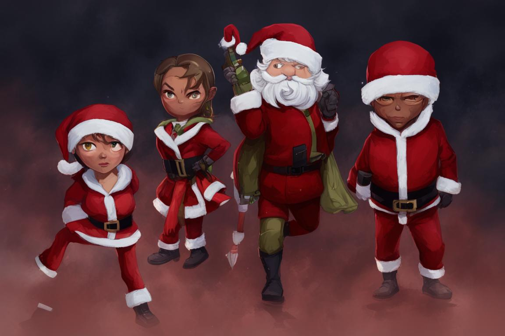

## DedMorozChallenge2023

В Пензенской области насчитывается 184 000 детей в возрасте до 14 лет. 

Агентурная сеть Деда Мороза сообщает, что у каждого из детей есть список желаемых подарков (всего 1000 наименований), отсортированный в порядке предпочтений.

Агенты Деда Мороза:

Кроме того, у Деда Мороза есть собственный список, - какой подарок соответствует какому ребенку (тоже в порядке предпочтений).

Перед помощниками Деда Мороза встала большая проблема - как распределить подарки так, чтобы все остались довольны - и дети и Дед Мороз.
Они не учились на кафедре ВТ и естественно ничего не знают про алгоритмы и их реализацию. Им требуется ваша помощь.

Список желаемых подарков детей содержится в файле https://github.com/kafvtpnz/DedMorozChallenge2023/blob/master/blob/master/kids_wish.csv

Первый столбец - ID ребенка, остальные - ID желаемого подарка в порядке приоритета (2 столбец более важен чем 3 и т.д.). Столбцы отделены запятыми, каждая строка - список желаемых ребенком подарков.

Список Деда Мороза содержится в файле https://github.com/kafvtpnz/DedMorozChallenge2023/blob/master/blob/master/ded_moroz_wish.csv

Первый столбец - ID подарка, остальные - ID детей, по мнению Деда Мороза заслуживающих этот подарок в порядке приоритета (2 столбец более важен чем 3 и т.д.). Столбцы отделены запятыми, каждая строка - список детей для конкретного подарка.

Количество каждого вида подарков ограничено 250 штуками, т.е. всего есть 1000 видов подарков по 250 штук каждого вида на 184 000 детей.

Вам предстоит разработать алгоритм, который поставит в соответствие каждому ребенку подарок таким образом, чтобы максимизировать Усредненный Нормализованный Индекс Счастья (УНИС).

# УНИС = УНИСД + УНИСДМ,

где УНИСД - Усредненный Нормализованный Индекс Счастья Детей,
    УНИСДМ - Усредненный Нормализованный Индекс Счастья Деда Мороза

# УНИСД = sum(СчастьеРебенка)/КоличествоДетей,

где СчастьеРебенка = 2 * (100 - №столбцаПодаркаИзСписка), если ребенку достался подарок из его списка 
или СчастьеРебенка = -1, если полученный им подарок не был в его списке.

Например, если ребенку достался подарок, который в его списке (в строке с ID этого ребенка в файле kids_wish.csv) стоит под номером 3, то СчастьеРебенка = 2*(100-3) = 194, а если подарок стоит в столбце под номером 90, то СчастьеРебенка = 2*(100-90) = 20.

Аналогично вычисляется 
# УНИСДМ = sum(СчастьеДедаМороза)/КоличествоПодарков,

где СчастьеДедаМороза = 2 * (184 - №столбцаРебенкаИзСписка), если подарок достался ребенку из списка
или СчастьеДедаМороза = -1 если подарок достался ребенку не из списка.

Проблему осложняет и то, что родители близнецов (их порядка 3 %) хотят чтобы они получили одинаковый подарок, иначе будут ссоры. ID близнецов 0...5519, они идут парой, т.е. ID 0 и ID 1 - близнецы, ID 2 и ID 3 - близнецы и т.д. ID 5520...183999 - обычные дети (не близнецы).

На основании имеющейся информации необходимо выбрать подарок каждому ребенку. 

# Список сформированных подарков необходимо сохранить в виде файла с расширением csv.
Формат файла:
1 столбец – ID ребенка 
2 столбец – ID подарка  

Столбцы отделяются запятыми. Заголовки столбцов - ChildId,GiftId.

Пример выходного файла [https://github.com/kafvtpnz/DedMorozChallenge2023/blob/master/blob/master/solution_example.сsv](https://github.com/kafvtpnz/DedMorozChallenge2023/blob/master/blob/master/solution_example.csv)

# Главный приз для автора лучшего решения
Автомат за экзамен и курсовой + флешка.

Для авторов 5 лучших решений: Автомат за экзамен и курсовой.

!!! Можно объединяться в команды не более 3 человек !!!
